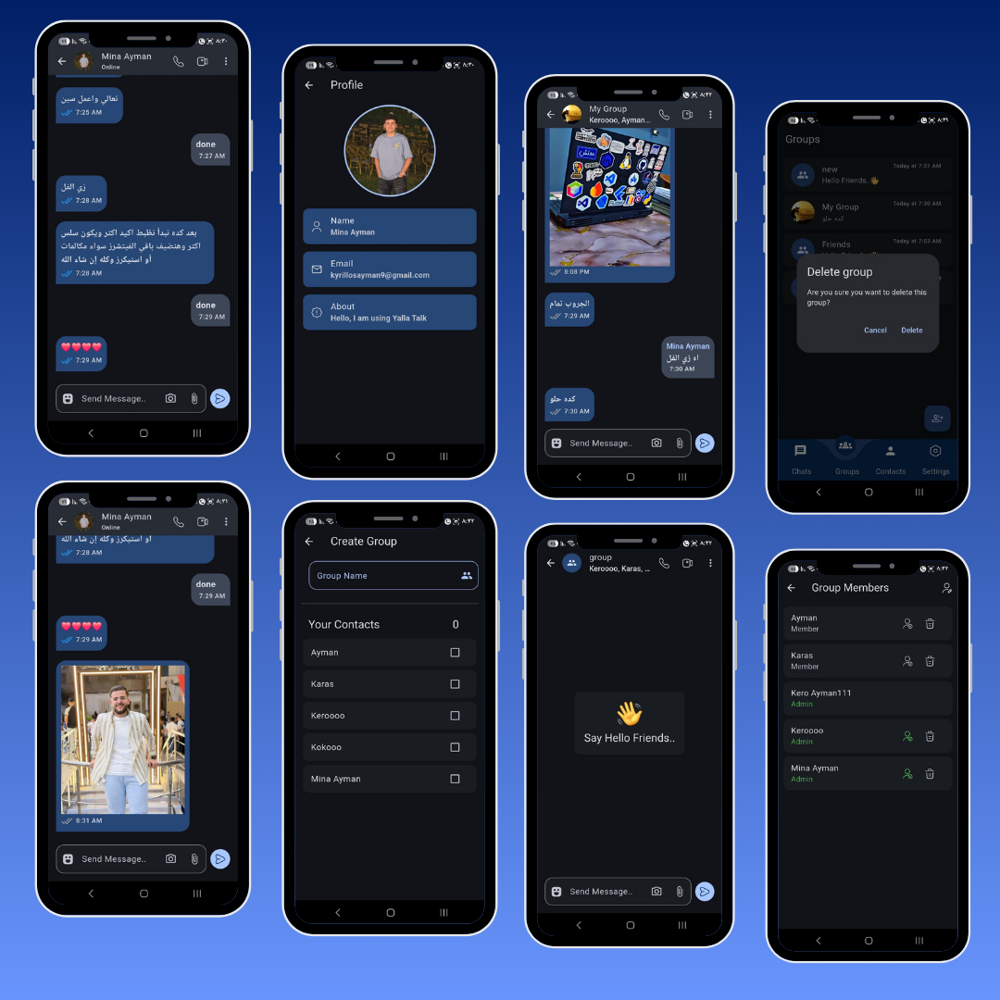
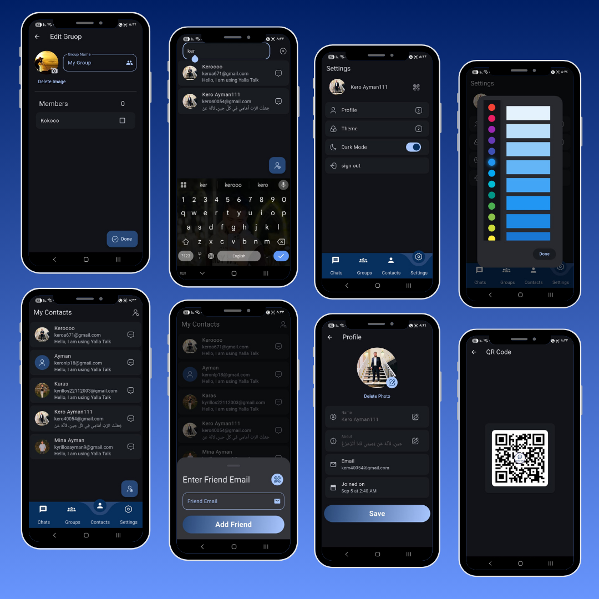
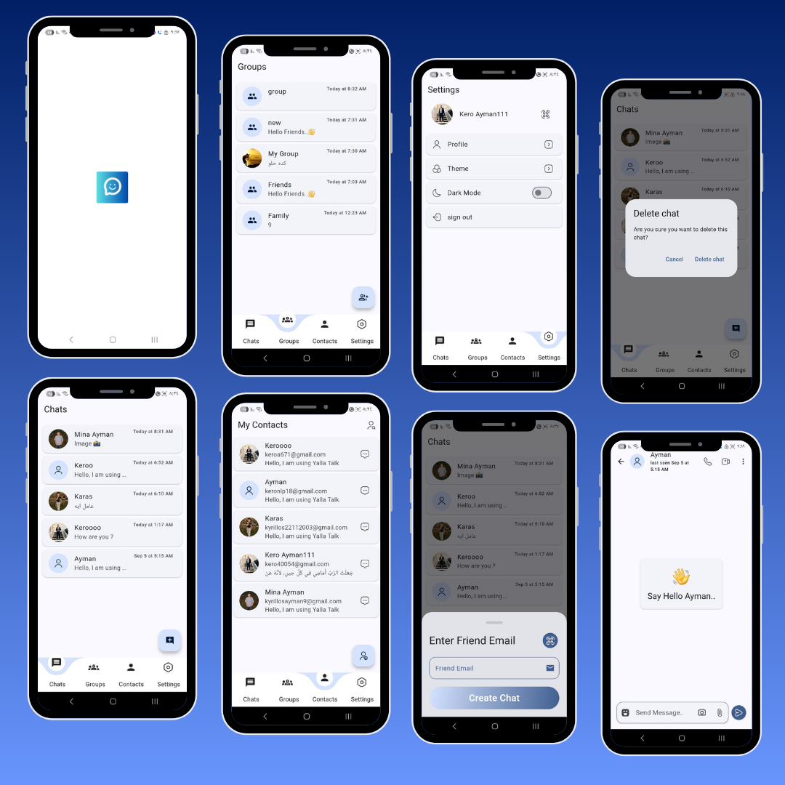
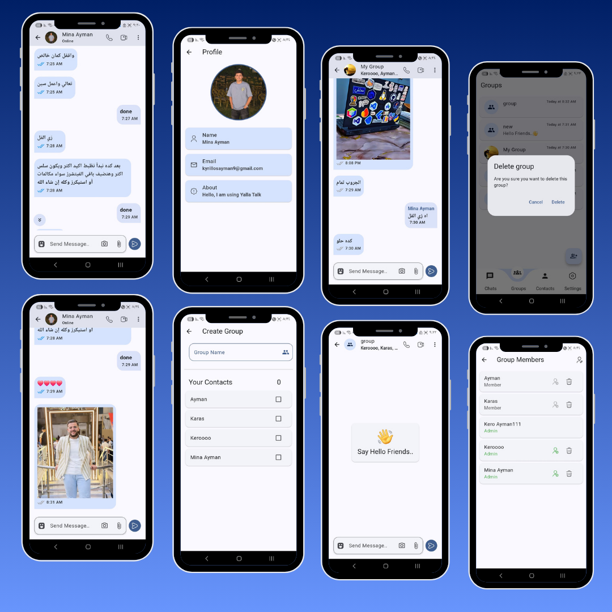
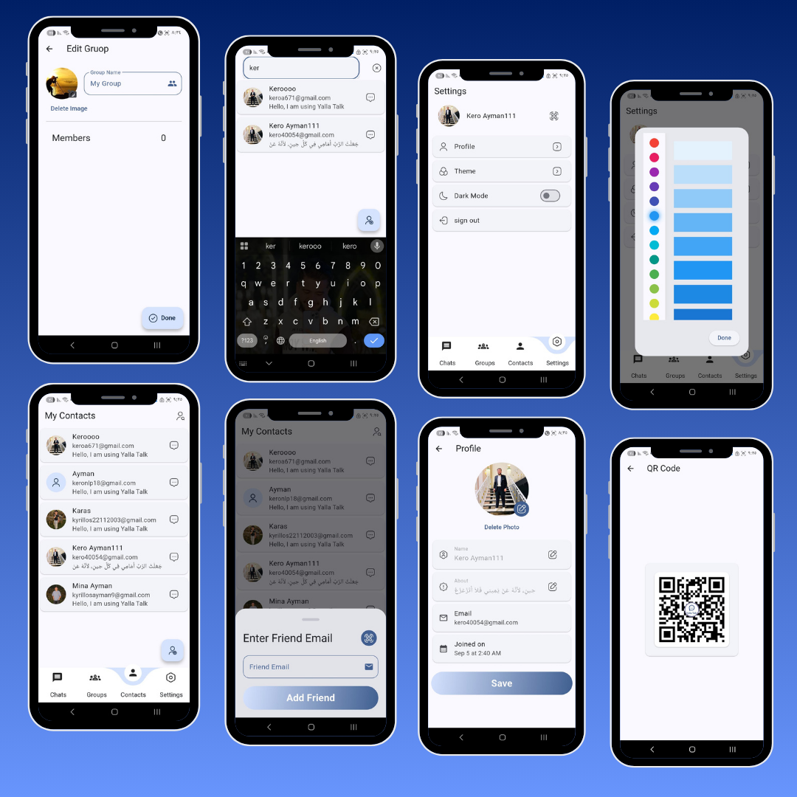
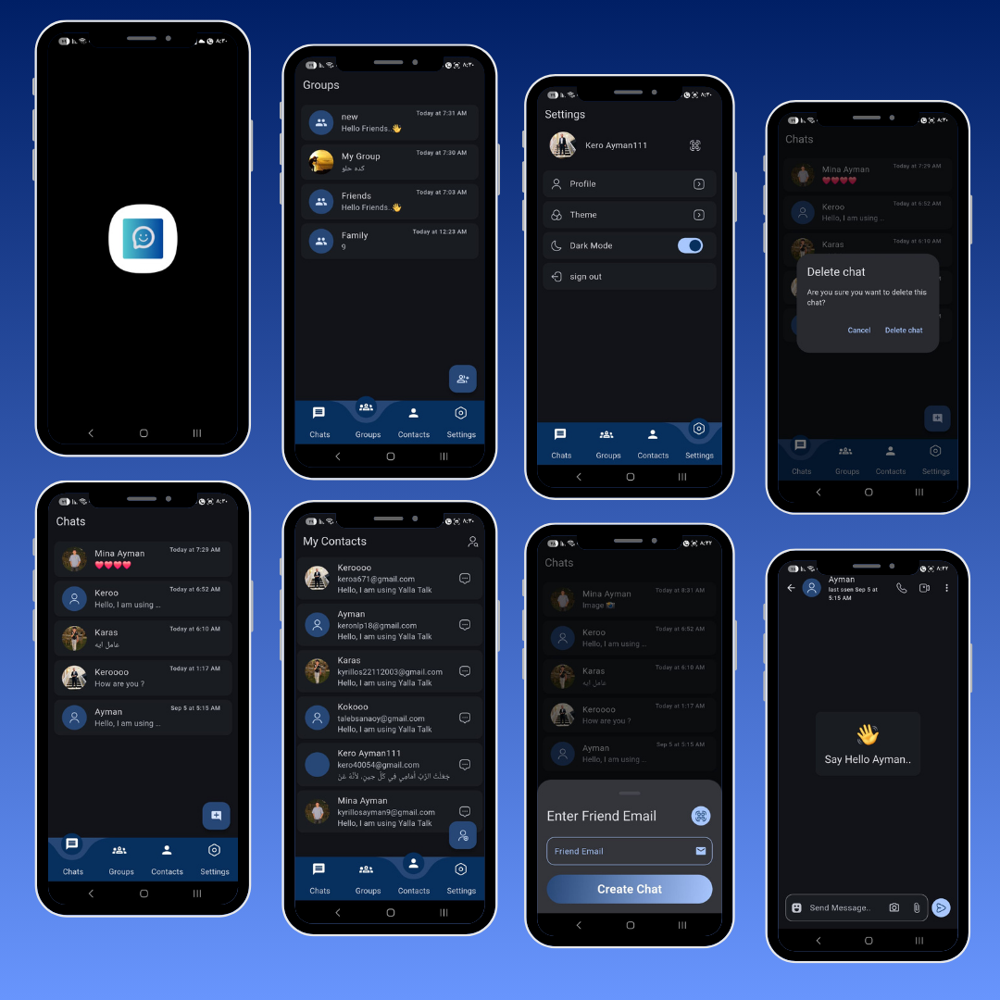

# 📱 Yalla Talk App

A real-time **chat application** built with **Flutter**, integrating **Firebase** and **Supabase** to provide authentication, messaging, group chats, and more.  
This project was developed as a learning challenge over 2 months to explore how chat apps like WhatsApp & Telegram handle messaging, authentication, and state management. 🚀

---

## ✨ Features

- 🔐 **Authentication**
  - Login / Signup with email & password
  - Form validation & error handling
  - User profile with name, bio, and avatar

- 💬 **Chat System**
  - 1-to-1 private messaging
  - Group chat support
  - Online / last seen status
  - Read receipts

- 🖼 **Media**
  - Profile & group images stored in **Supabase Storage**
  - Cached image loading

- ⚙️ **User Experience**
  - Dark & light themes
  - Editable profile (name, about, email)
  - Custom snackbars & dialogs

---

## 🛠 Tech Stack

- **Frontend:** Flutter (Material Design, Provider, Bloc)
- **Backend:**
  - Firebase Authentication (login/signup + email verification)
  - Firebase Firestore (real-time database for chats & groups)
  - Supabase (authentication, database, storage for images/files)
- **Packages Used:**
  - `firebase_core`
  - `firebase_auth`
  - `cloud_firestore`
  - `supabase_flutter`
  - `provider`
  - `uuid`
  - `cached_network_image`
  - `flutter_native_splash`
  - `photo_view`

---

## 📸 Screenshots

<p align="center">
  
  
  
  
  
  
  
</p>

---

## 🚀 Getting Started

### Prerequisites
- Install [Flutter SDK](https://docs.flutter.dev/get-started/install)  
- Setup a Firebase project & Supabase project  
- Configure your `google-services.json` and `supabase` credentials  

### Installation
```bash
# Clone the repository
git clone https://github.com/your-username/yalla_talk_app.git

# Navigate to project
cd yalla_talk_app

# Install dependencies
flutter pub get

# Run the app
flutter run
