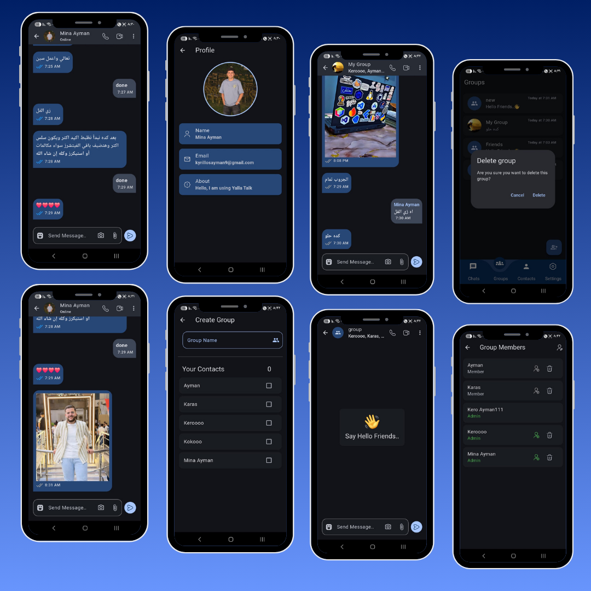
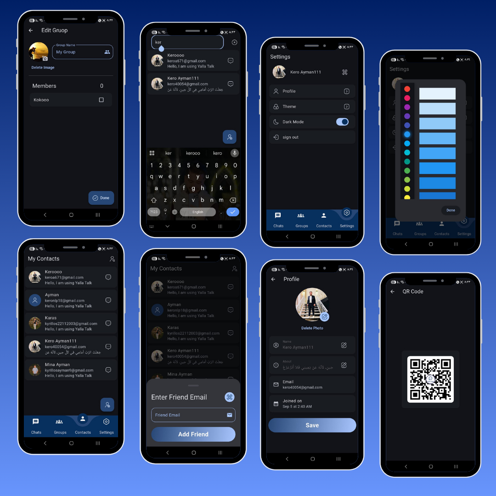
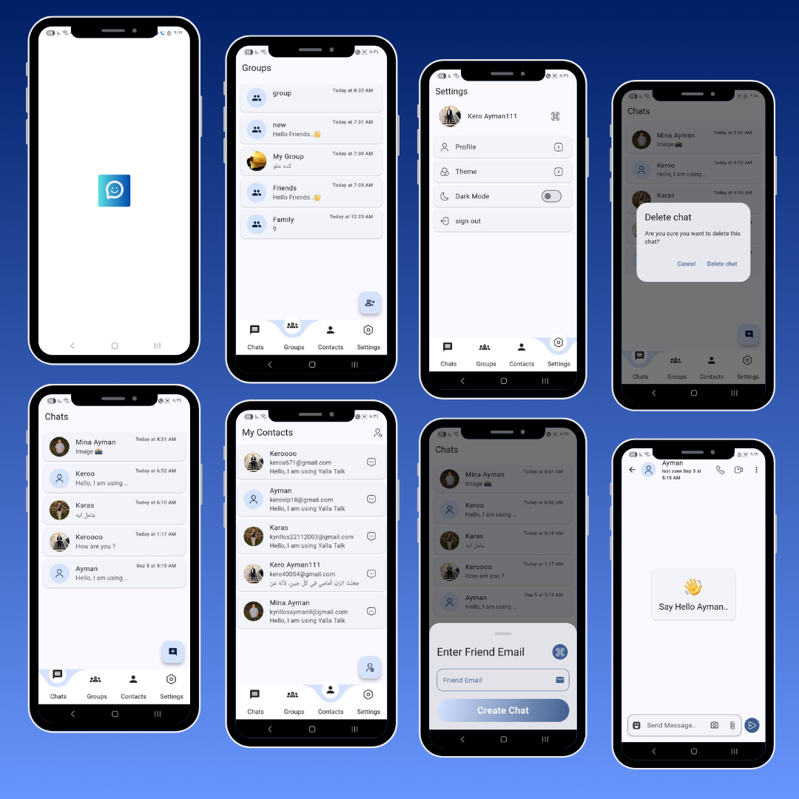
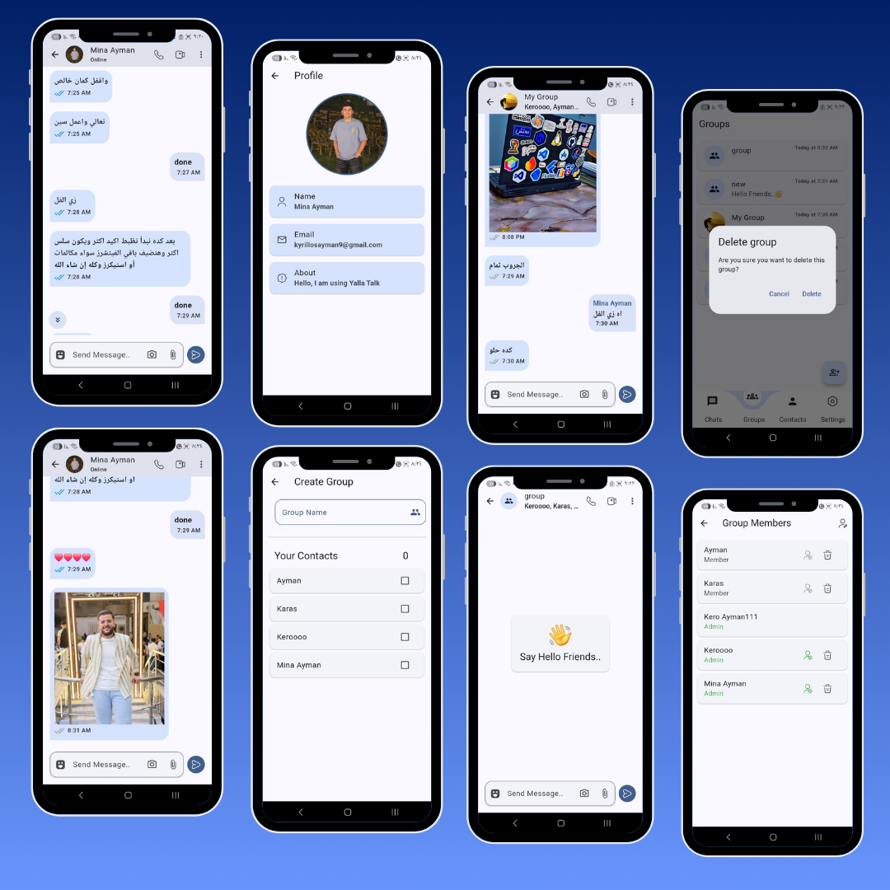
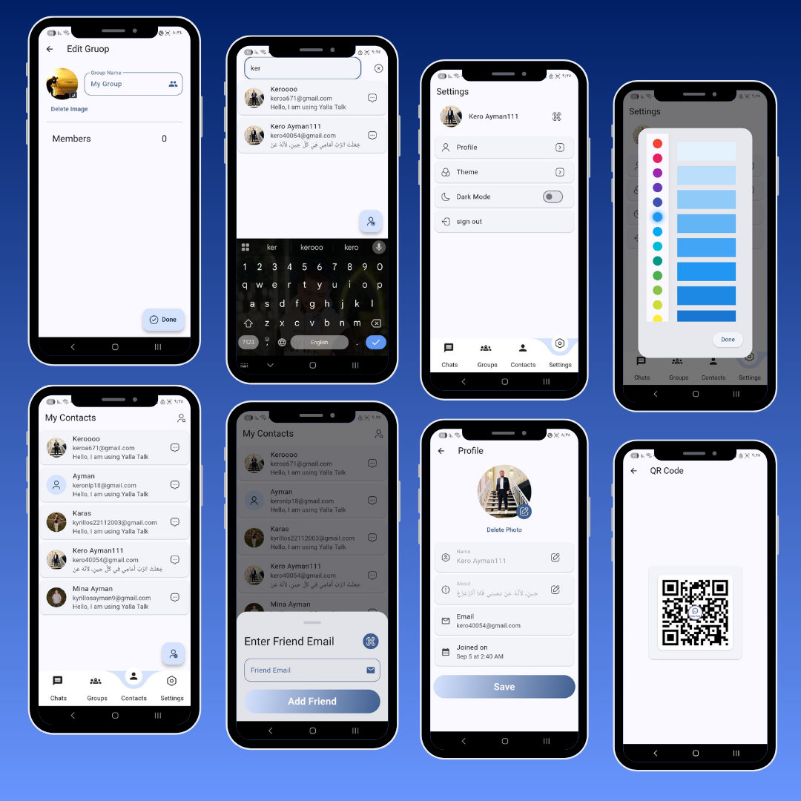
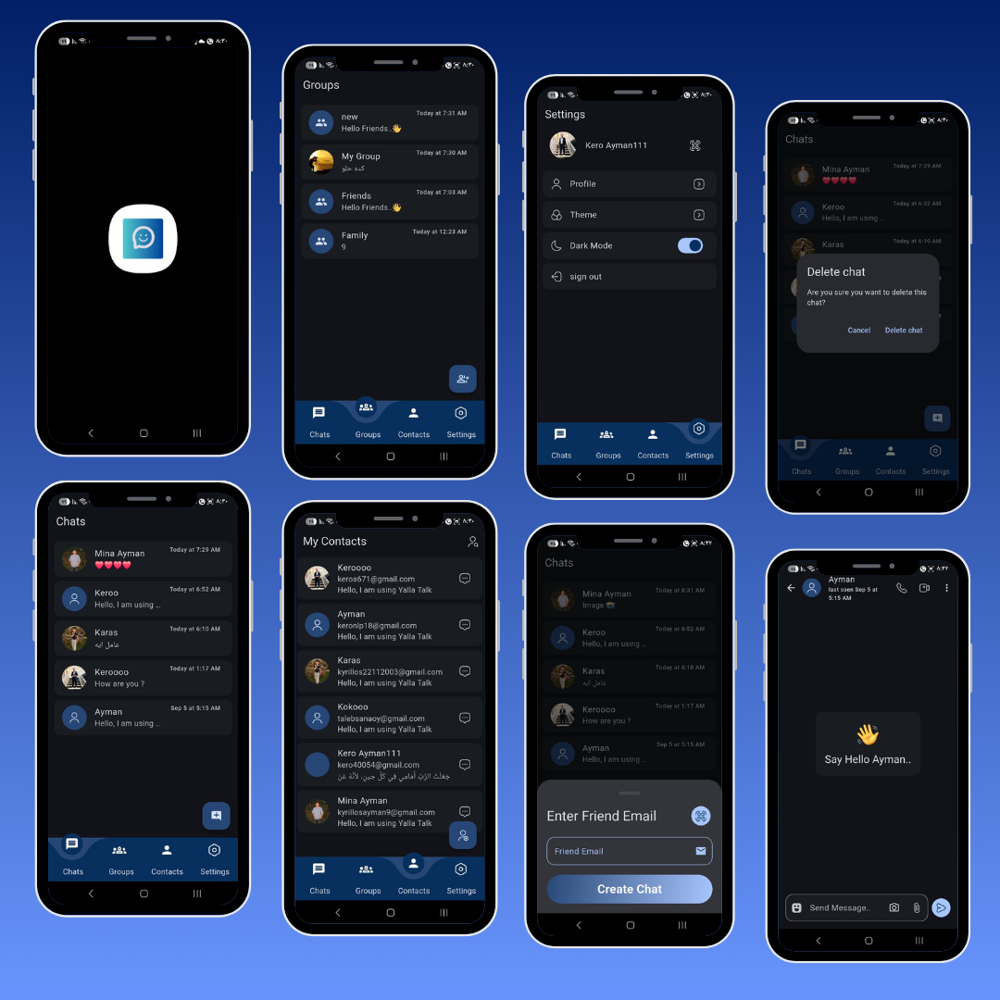

# 📱 Yalla Talk App

A real-time **chat application** built with **Flutter**, integrating **Firebase** and **Supabase** to deliver a seamless messaging experience similar to WhatsApp & Telegram.

This project was developed over 2 months as a learning journey to master real-time systems, authentication, and scalable app architecture. 🚀

---

# 📸 App Screenshots

.png)













---

# ✨ Features

## 🔐 Authentication
- Signup / Login with Email & Password  
- Email verification  
- Form validation & error handling  

## 👤 User Profile
- Edit name, bio, profile image  
- Last seen status  

## 💬 Chat System
- Real-time private messaging  
- Group chats with admins  
- Read receipts  
- Online / last seen indicators  
- Delete messages  

## 👥 Groups
- Create groups  
- Add / remove members  
- Promote / demote admins  

## 🖼 Media Support
- Send & receive images  
- Supabase Storage integration  
- Cached image loading  

## ⚙️ UI/UX
- Dark & Light themes  
- Clean Material Design UI  
- Custom dialogs & snackbars  

---

# 🛠 Tech Stack

## Frontend
- Flutter (Dart)
- Provider / Bloc
- Material Design

## Backend & Services
- Firebase Authentication
- Firebase Firestore (Realtime Database)
- Supabase (Storage + Database utilities)

## Packages Used
- firebase_core  
- firebase_auth  
- cloud_firestore  
- supabase_flutter  
- provider  
- uuid  
- cached_network_image  
- flutter_native_splash  
- photo_view  

---

# 🚀 Getting Started

## Prerequisites
- Flutter SDK installed  
- Firebase project setup  
- Supabase project setup  
- Android Studio / VS Code  

---

## Installation

### 1️⃣ Clone the repository

```bash
git clone https://github.com/your-username/yalla_talk_app.git
```

### 2️⃣ Navigate to project

```bash
cd yalla_talk_app
```

### 3️⃣ Install dependencies

```bash
flutter pub get
```

### 4️⃣ Run the app

```bash
flutter run
```

---

# 💡 What I Learned

- Real-time systems with Firestore  
- Authentication flows  
- Scalable Flutter architecture  
- State management  
- Firebase + Supabase integration  
- Building production-level chat apps  

---

# 🔮 Future Improvements

- 🔔 Push Notifications  
- 🎤 Voice & Video Calls  
- 🧠 AI chat assistant  
- ☁️ Cloud sync optimization  
- 📊 Admin dashboard  
- 🔒 End-to-end encryption  

---

# 👨‍💻 Developer

## Kyrillos Ayman

Flutter Developer passionate about building real-time scalable mobile applications.

---

# ⭐ Support

If you like this project, don't forget to give it a ⭐ on GitHub!
